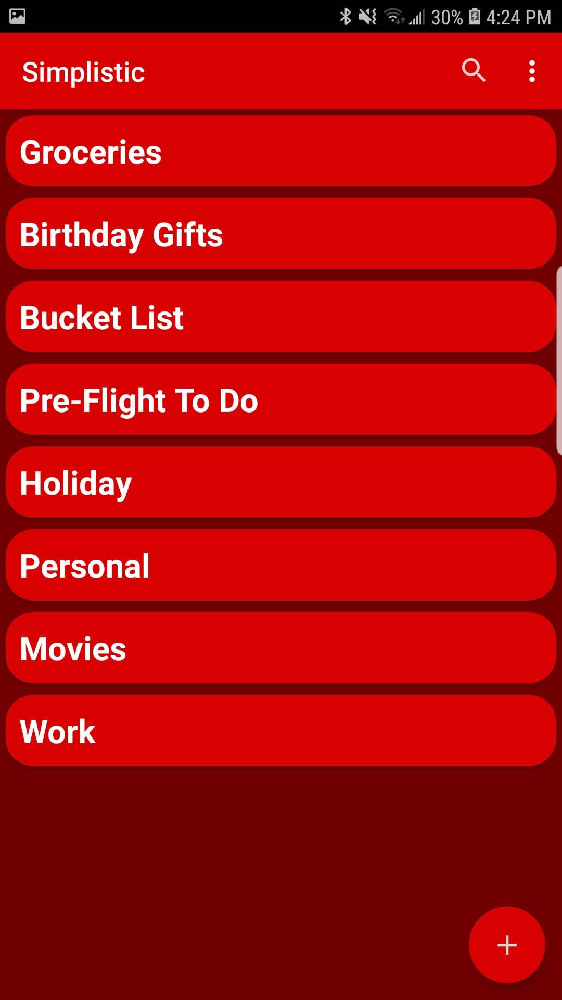
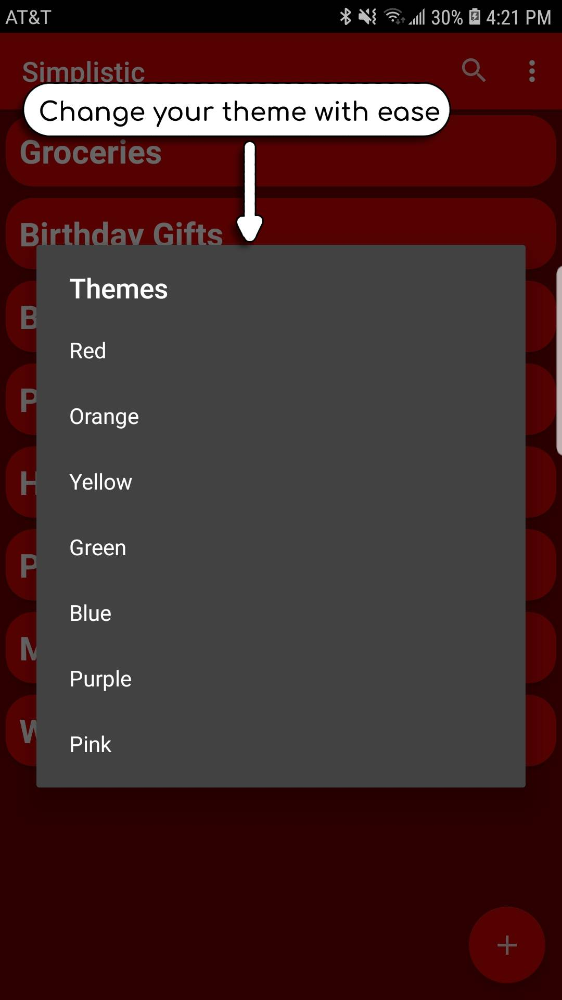
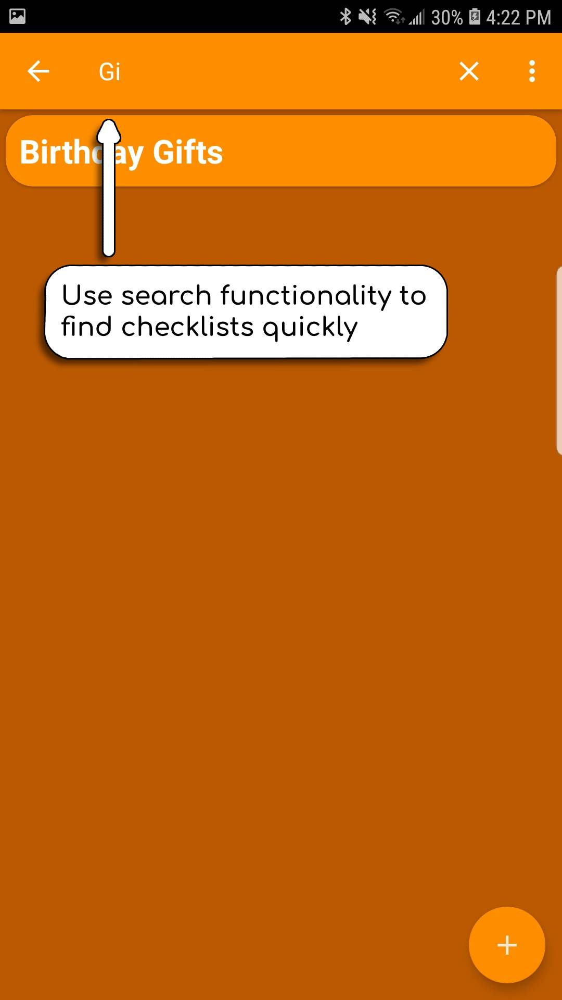
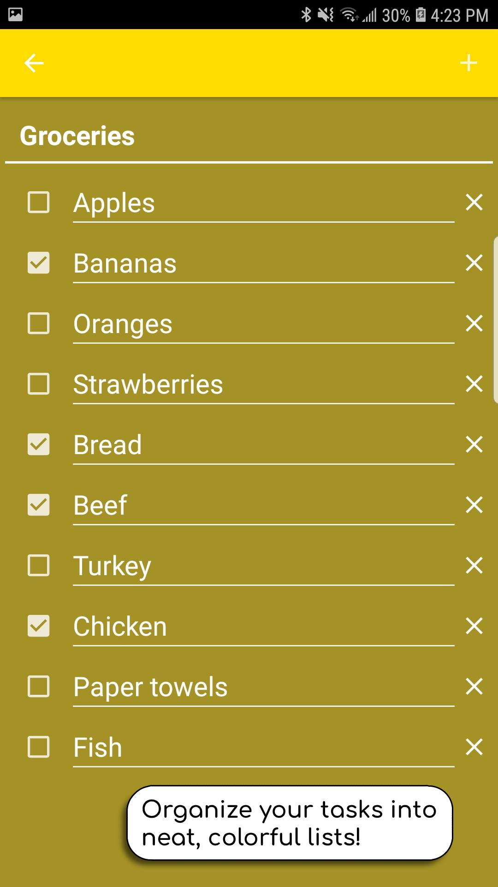
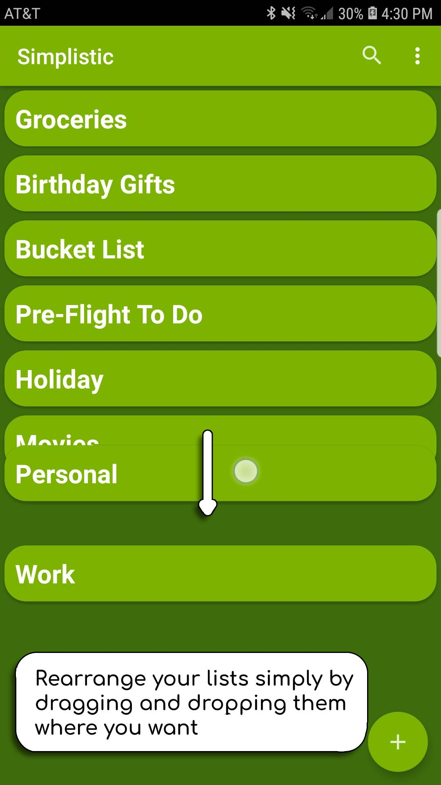
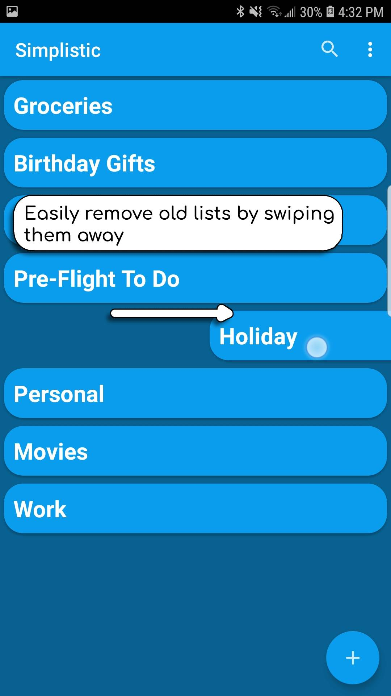
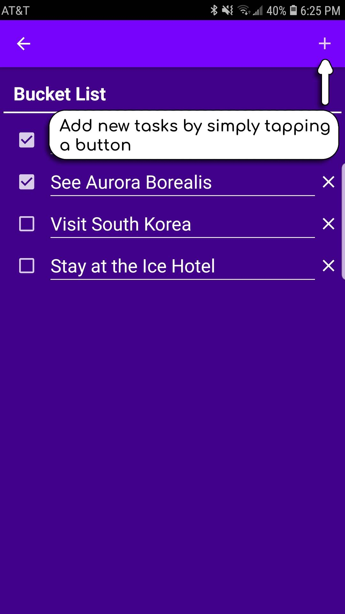
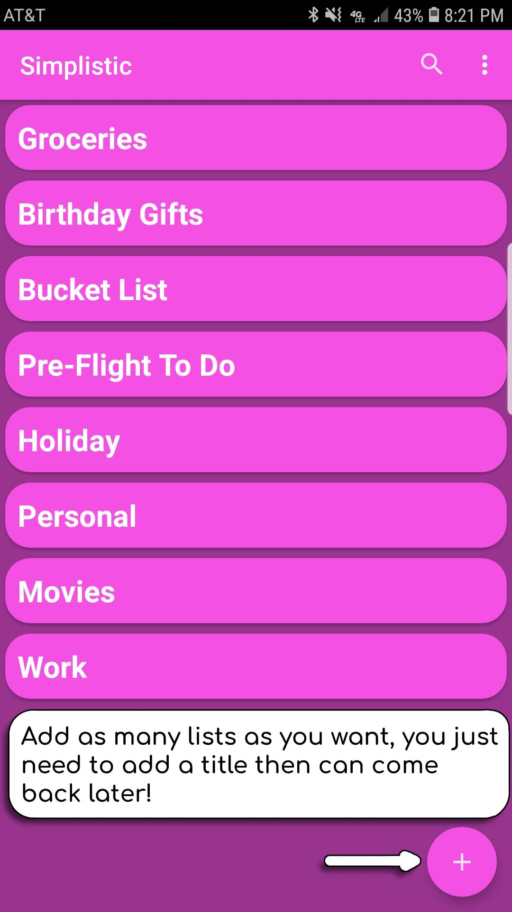

# Simplistic
## This is a simple Checklist app, demonstrating the following:
- *RecyclerViews*
- *Swipe and Drag functionality*
- *Custom Views*
- *JSON File writing and parsing*
- *Search/Filter functionality*
- *Parcelable interfacing*
- *Intent usage*
- *ConstraintLayout*
- *LinearLayout*
- *FAB*

**Simplistic Demo:**

              
